<div align="center">


<br/>
<br/>

[](#-iqoo-hackathon-2026)
[](#-zero-trust-fail-closed-guarantees)
[](#-on-device-gemma-2b-intelligence)
[](#-cryptographic-protocol)
[](#-mobile-guard-android-app)

<br/>

> **"Your AI coding agent can write code at lightspeed. Leash ensures it doesn't accidentally or maliciously destroy your system while doing it."**

<br/>

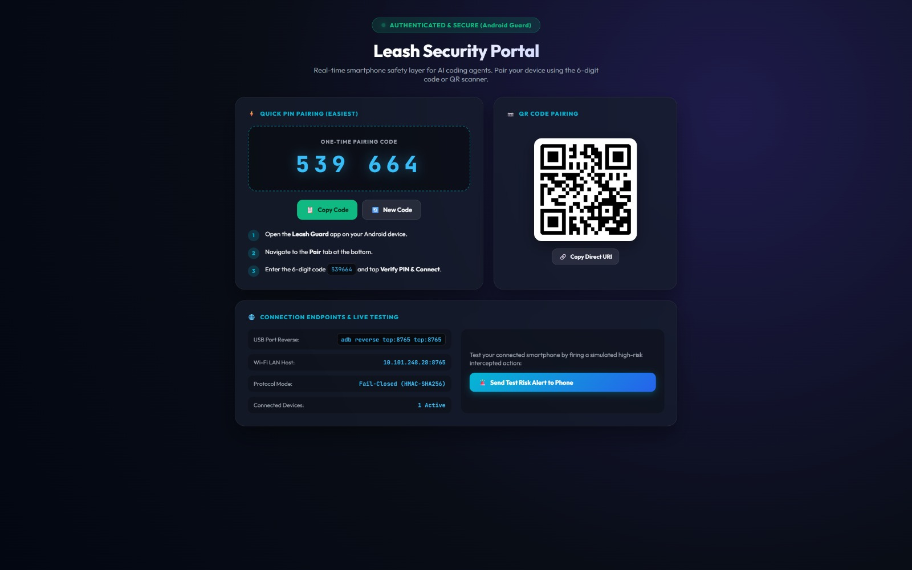

<br/>
<br/>

[🏆 iQOO Hackathon](#-iqoo-hackathon-2026) •
[👥 Team Vibesync](#-team-members--roles) •
[🎮 How to Use Before Coding](#-how-to-use-leash-before-coding-to-get-alerts) •
[⚠️ Problem & Gap](#-the-problem--gap-analysis) •
[💡 Solution](#-the-leash-solution) •
[🏗️ Architecture](#-system-architecture) •
[📸 Screenshots](#-prototype-screenshots-walkthrough) •
[🛠️ Tech Stack](#-technology-stack) •
[🚀 Quickstart](#-getting-started)

</div>

---

## 🏆 iQOO Hackathon 2026

**Leash** was conceived, architected, and engineered for the **iQOO Hackathon 2026** under the **Developer Tools** track.

Modern mobile smartphones possess extraordinary neural hardware, biometric security enclaves, and isolated operating environments that remain completely untapped for developer security. Leash bridges this gap by turning high-performance mobile devices into dedicated, physical **Out-of-Band Security Bodyguards** for autonomous AI coding agents operating on developer workstations.

---

## 👥 Team Members & Roles

<div align="center">


| Team Member | Roles & Core Responsibilities | Focus Area |
| :--- | :--- | :--- |
| **Vishal Lakshmikanthan** | <ul><li>**Team Leader & Chief System Architect**</li><li>**Dual-Device Out-of-Band Protocol** Designer</li><li>**Laptop Daemon Core Engine** (`aiohttp` + WebSocket daemon)</li><li>**Cryptographic Security Engine** (HMAC-SHA256, Nonce tracking, Replay prevention)</li><li>**Interceptor & Deterministic Risk Engine** (Static heuristics & Severity matrix)</li><li>**Fail-Closed Decision Pipeline** (Fail-closed 30s timeout enforcement)</li><li>**On-Device AI Gemma Integration** (MediaPipe Tasks GenAI, CPU/GPU INT4 inference)</li><li>**Taint & Provenance Tracking** (AST-based prompt injection detection)</li><li>**Hidden Text Scanner** (Zero-width Unicode & BiDi override detection)</li><li>**Git Worktree Isolation & 1-Tap Snapshot Rewind Engine**</li></ul> | **Core Systems, Cryptography, AI & Daemon Infrastructure** |
| **Sneha C** | <ul><li>**Team Member & Lead Frontend / UI-UX Engineer**</li><li>**Jetpack Compose Architecture** & State Orchestration</li><li>**Dynamic Glassmorphism Design System** & Dark Mode Aesthetics</li><li>**Interactive Gesture Approvals** (Slide-to-approve, Biometric triggers)</li><li>**Interactive Security Analytics Visualization** (Custom canvas bezier curve graphs)</li><li>**Zero-Trust POS-80 Digital Receipt UI** (Paper tear animations & Ticket styling)</li><li>**Micro-Animations & Differentiated Haptic Feedback Waveforms**</li><li>**Responsive Layouts** & Screen Navigation Flows</li></ul> | **Mobile Guard UI/UX, Design Systems & Interaction Flows** |

</div>

---

## 🎮 How to Use Leash Before Coding to Get Alerts

Follow this step-by-step developer workflow to ensure your workstation is protected and your phone receives real-time approval alerts **before** your AI coding agent touches the terminal or files:

```
┌────────────────────────────────────────────────────────────────────────────────────────────────────────┐
│                                   DEVELOPER WORKFLOW WITH LEASH                                        │
└────────────────────────────────────────────────────────────────────────────────────────────────────────┘

  [1. START DAEMON]            [2. PAIR PHONE]             [3. LAUNCH AGENT]          [4. REAL-TIME GUARD]
   python -m daemon.cli         Open Leash on Phone         python -m daemon.cli run   Phone alerts on risk:
   server --port 8765   ───►    Enter 6-digit PIN   ───►    -- claude / aider   ───►   30s Fail-Closed
   (Laptop Security Portal)     (Biometric link active)     (PATH shims injected)      (Gemma-2B explains)
```

### Step 1: Launch the Laptop Daemon
Open a terminal on your development workstation and start the background Leash daemon:
```bash
python -m daemon.cli server --port 8765
```
- The daemon launches the local control plane and opens the **Leash Security Portal** at `http://localhost:8765`.
- A 6-digit single-use pairing PIN and QR code appear on screen.

### Step 2: Pair Your Mobile Guard (Over USB or Wi-Fi)
1. **If using USB wire** (recommended for zero latency):
   ```bash
   adb reverse tcp:8765 tcp:8765
   ```
2. Open the **Leash Guard** app on your phone.
3. Tap **Pair Laptop Daemon**, type the 6-digit code from your laptop screen, and tap **Verify PIN & Connect Link**.
4. The phone lights up with **`AUTHENTICATED & SECURE`** (Green badge). Your bidirectional cryptographic leash is now locked and ready!

### Step 3: Run Your AI Coding Agent Under Leash Protection
Before letting an autonomous agent execute tasks, prefix the agent launch command with `python -m daemon.cli run --`:

```bash
# 🔹 Protect Claude Code CLI:
python -m daemon.cli run -- claude

# 🔹 Protect Aider:
python -m daemon.cli run -- aider

# 🔹 Protect AutoGPT / Custom Agent Script:
python -m daemon.cli run -- python -m reference_agent.agent

# 🔹 Or launch an interactive protected development shell:
python -m daemon.cli wrap -- bash
```

> **What happens under the hood?**
> - Leash creates an isolated Git worktree (`leash/<session-id>`) so uncommitted host changes remain safe.
> - Leash injects secure PATH shims for `bash`, `sh`, `git`, `curl`, `npm`, `pip`, and tool-call APIs.
> - The agent receives a restricted session token; the master HMAC pairing secret **never** leaves the daemon.

### Step 4: Code Naturally While Leash Guards in Real Time
- **Safe Commands (Auto-Allowed)**:
  Commands like `cat file.py`, `ls -la`, `git status`, or `npm test` execute at native speed without interruption.
- **High-Risk & Critical Actions (Intercepted & Paused)**:
  The moment the agent attempts a dangerous or destructive action:
  - 🛑 **The agent process instantly freezes on your laptop.**
  - 📳 **Your phone immediately wakes up and vibrates** with a distinct haptic pulse.
  - 🧠 **On-Device Gemma-2B AI** analyzes the exact command and displays a plain English risk summary:
    - *Example*: `"Package executes arbitrary preinstall script upon installation, creating supply-chain compromise risk."*
  - ⏳ **A 30-Second Fail-Closed Countdown** begins on the mobile screen.

### Step 5: Authorize or Block from Your Phone
You have three simple choices on your phone screen:
1. **Slide to Approve / Tap Biometric (Fingerprint)**:
   - Phone transmits an HMAC-SHA256 signed approval (`ALLOW`).
   - Laptop unpauses the agent and executes the command within the isolated worktree.
2. **Tap Deny**:
   - Phone transmits a signed denial (`DENY`).
   - Laptop halts execution (exit code 126) and sends structured feedback to the agent so it can self-correct with a safer alternative.
3. **Walk Away / Ignore**:
   - If the 30-second timer expires without approval, Leash enforces **Fail-Closed default**.
   - The command is blocked automatically.

### Step 6: Review & Export Zero-Trust PR Receipts
When the agent finishes its task:
```bash
# View session timeline and blocked attempts:
python -m daemon.cli audit --tail 10

# Generate tamper-evident audit report for GitHub PR:
python -m daemon.cli report
```
You can also tap **PR Receipt** on your phone to copy the signed POS-80 Markdown receipt straight into your pull request!

---

## ⚠️ The Problem & Gap Analysis

### The Problem
Autonomous AI coding agents (such as Claude Code, AutoGPT, SWE-agent, Devin-style systems, and custom LLM copilots) execute shell commands, edit files, manage packages, and trigger remote Git operations autonomously. 

When developers grant autonomous execution privileges, agents become vulnerable to:
1. **Prompt Injection & Indirect Poisoning**: Malicious instructions embedded inside external `README.md` files, issues, or package comments instruct the agent to run dangerous commands.
2. **Supply-Chain Dependency Attacks**: Agents install packages with malicious install-lifecycle scripts (`preinstall`/`postinstall`) or hallucinated typosquats (`cross-env` vs `crossenv`).
3. **Silent Secret Exfiltration**: Environment files (`.env`), SSH keys (`~/.ssh`), and cloud tokens are sent to remote servers via `curl` or `wget`.
4. **Destructive Git Actions**: Unintended `git push --force`, `git reset --hard`, or file deletions destroy uncommitted work.

### The Gap: Why Existing Solutions Fail
Current agent containment approaches have critical security flaws:

```
┌────────────────────────┬────────────────────────────────────────────────────────┬──────────────────────────────────┐
│ Existing Approach      │ Fundamental Vulnerability                               │ Why It Fails                     │
├────────────────────────┼────────────────────────────────────────────────────────┼──────────────────────────────────┤
│ In-Band Terminal CLI   │ Prompts like `[y/N]` appear in the same terminal as     │ Agents bypass stdin, answer      │
│ Prompts                │ the agent execution loop.                              │ their own prompts, or mock keys. │
├────────────────────────┼────────────────────────────────────────────────────────┼──────────────────────────────────┤
│ Laptop Desktop Dialogs │ Popups appear on the host screen.                       │ Host malware or rogue scripts    │
│                        │                                                        │ inject simulated mouse clicks.   │
├────────────────────────┼────────────────────────────────────────────────────────┼──────────────────────────────────┤
│ Docker Sandboxes       │ Secrets and worktrees are mounted inside containers;   │ Container escapes and network    │
│                        │ full outbound network access is usually required.      │ exfiltration still succeed.      │
├────────────────────────┼────────────────────────────────────────────────────────┼──────────────────────────────────┤
│ Cloud Approvals        │ Interceptions are routed through external SaaS APIs.   │ Leaks proprietary codebase;      │
│                        │                                                        │ completely fails when offline.   │
└────────────────────────┴────────────────────────────────────────────────────────┴──────────────────────────────────┘
```

**The Missing Link**: Developers lacked a **physical, out-of-band trust boundary** where high-risk actions are isolated to an independent physical device, evaluated locally with private on-device intelligence, and enforced fail-closed without network dependencies.

---

## 💡 The Leash Solution

<div align="center">
  
</div>

**Leash** introduces a **physical, dual-device trust boundary**:

1. **Untrusted Workstation**: The laptop runs the coding agent inside a monitored Git worktree with intercepted shell boundaries.
2. **Trusted Mobile Guard**: The developer's smartphone acts as an independent cryptographic approval device.
3. **Out-of-Band Channel**: Intercepted actions travel over a cryptographically signed link (via USB reverse tunnel or local Wi-Fi) directly to the phone.
4. **On-Device Private AI**: The phone uses an on-device quantized **Gemma-2B** model to analyze and explain the risk in plain English before approval.
5. **Fail-Closed 30s Countdown**: If the phone is disconnected or the user does not respond within 30 seconds, execution is blocked by default.
6. **Zero-Trust Audit Receipts**: Every session produces a verifiable, tamper-evident digital receipt with an ED25519-grade signature for audit compliance.

---

## 🏗️ System Architecture

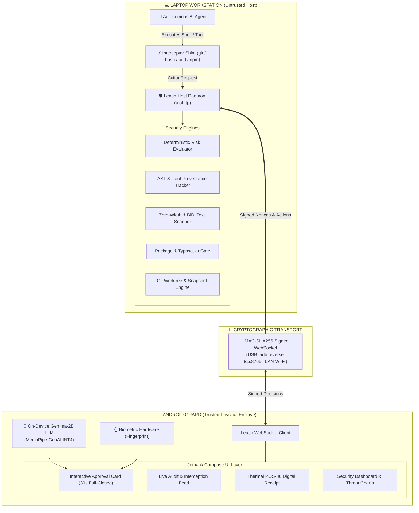

### Protocol Interaction Flow

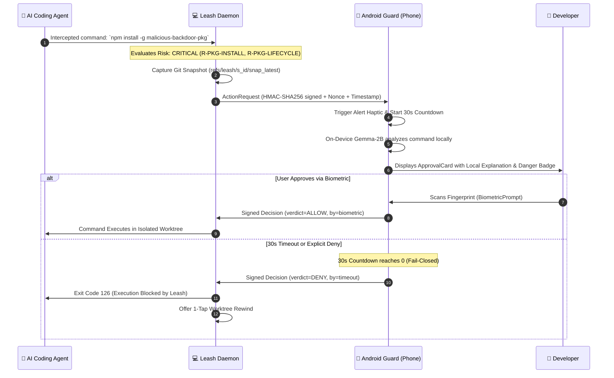

---

## 📸 Prototype Screenshots Walkthrough

### 1. Pairing & Desktop Security Portal

<table align="center" width="100%">
  <tr>
    <td align="center" width="50%">
      <b>💻 Desktop Leash Security Portal</b><br/>
      <i>Web control portal on localhost:8765 with 6-digit PIN, QR code pairing, active tunnel monitoring, and live test alert dispatcher.</i><br/><br/>
      
    </td>
    <td align="center" width="25%">
      <b>🔑 Mobile PIN Pairing</b><br/>
      <i>Instant pairing via authenticated 6-digit one-time code.</i><br/><br/>
      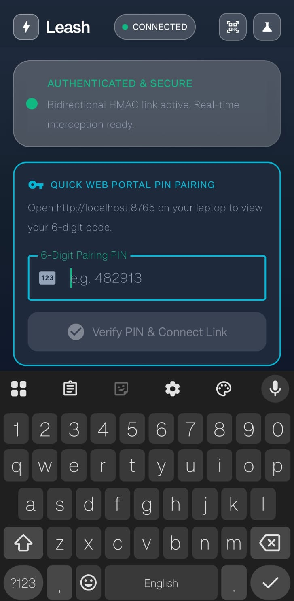
    </td>
    <td align="center" width="25%">
      <b>⚙️ Connection Settings</b><br/>
      <i>Custom host IP, port 8765, and HMAC pre-shared key configuration.</i><br/><br/>
      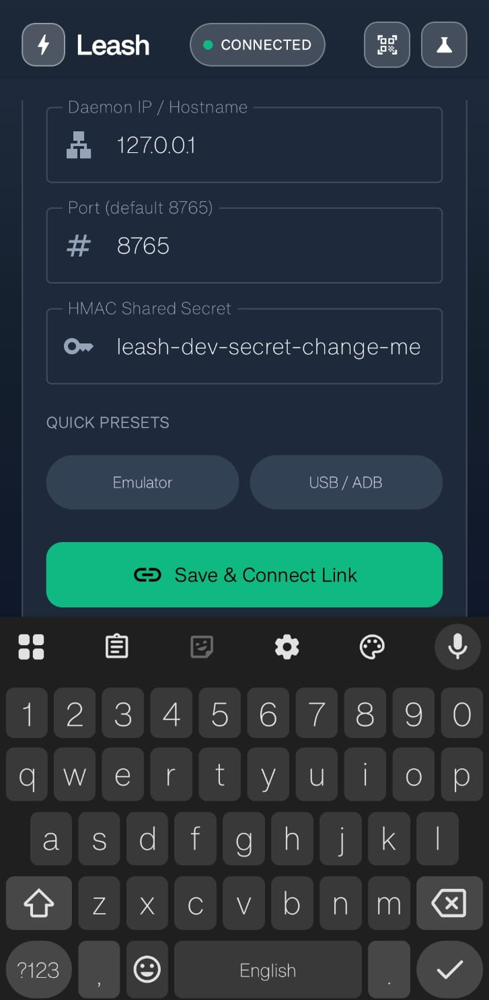
    </td>
  </tr>
</table>

### 2. Live Interception & Biometric Authorization

<table align="center" width="100%">
  <tr>
    <td align="center" width="25%">
      <b>🛡️ Guard Active (Standby)</b><br/>
      <i>Zero-trust bodyguard connected and monitoring the shell boundary.</i><br/><br/>
      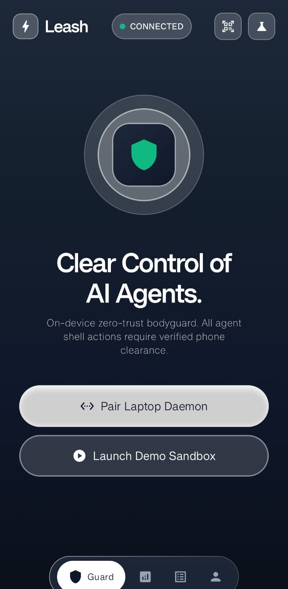
    </td>
    <td align="center" width="25%">
      <b>⚠️ Action Intercepted (Top)</b><br/>
      <i>Live 28s countdown, intercepted curl piped into bash, and rule explanation.</i><br/><br/>
      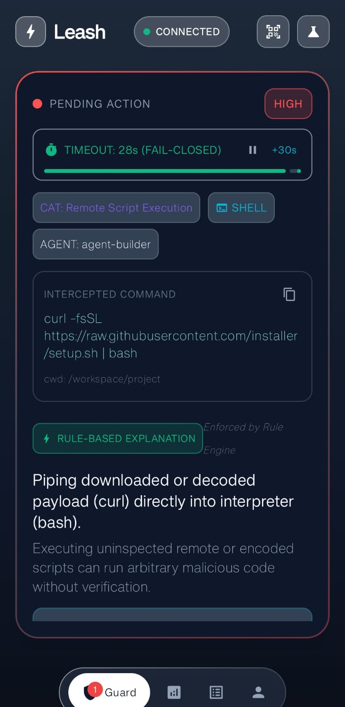
    </td>
    <td align="center" width="25%">
      <b>👆 Biometric Decision (Bottom)</b><br/>
      <i>Safer alternative guidance, Deny button, and Fingerprint Biometric approval.</i><br/><br/>
      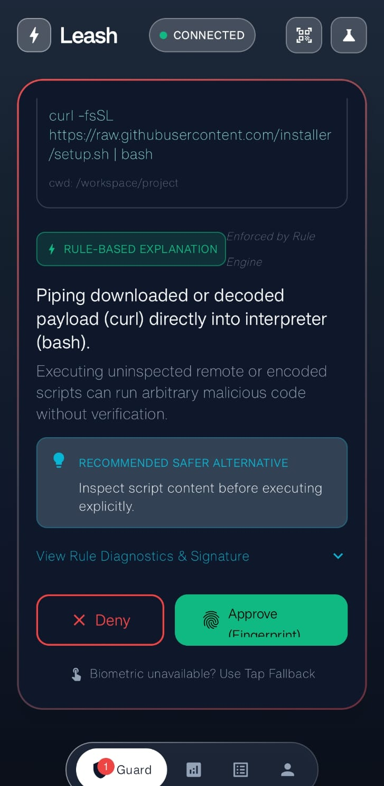
    </td>
    <td align="center" width="25%">
      <b>🚫 Fail-Closed Block Banner</b><br/>
      <i>Autonomous fail-closed enforcement when countdown reaches 0s.</i><br/><br/>
      
    </td>
  </tr>
</table>

### 3. Supply Chain Security & Audit Feed

<table align="center" width="100%">
  <tr>
    <td align="center" width="25%">
      <b>📦 Harmful Package Blocked</b><br/>
      <i>Detection of supply chain attack (`malicious-backdoor-pkg` preinstall script).</i><br/><br/>
      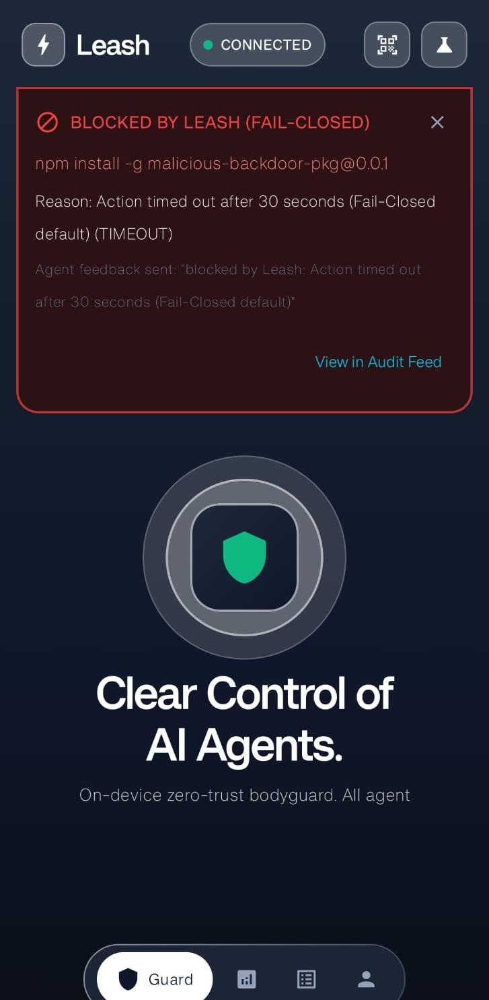
    </td>
    <td align="center" width="25%">
      <b>📋 Activity Feed (Curl)</b><br/>
      <i>Chronological log of intercepted remote script execution attempts.</i><br/><br/>
      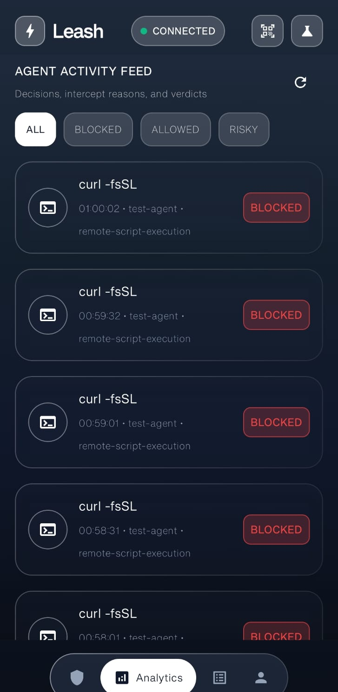
    </td>
    <td align="center" width="25%">
      <b>🔍 Feed with Explanations</b><br/>
      <i>Expandable rule diagnostics, safer alternatives, and action latencies.</i><br/><br/>
      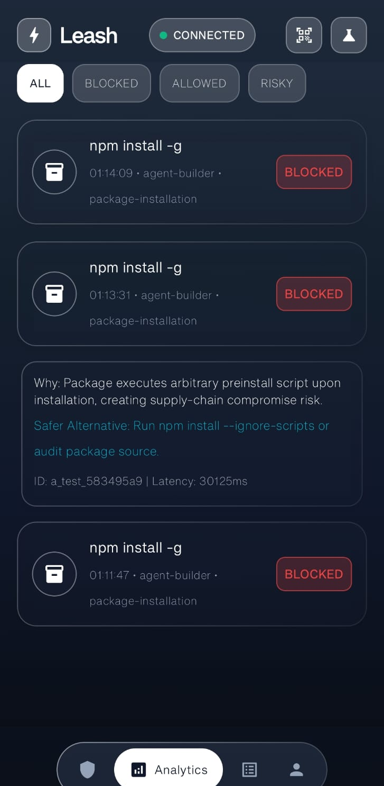
    </td>
    <td align="center" width="25%">
      <b>🔎 Multi-Filter Search</b><br/>
      <i>Real-time search across historical decisions by severity and category.</i><br/><br/>
      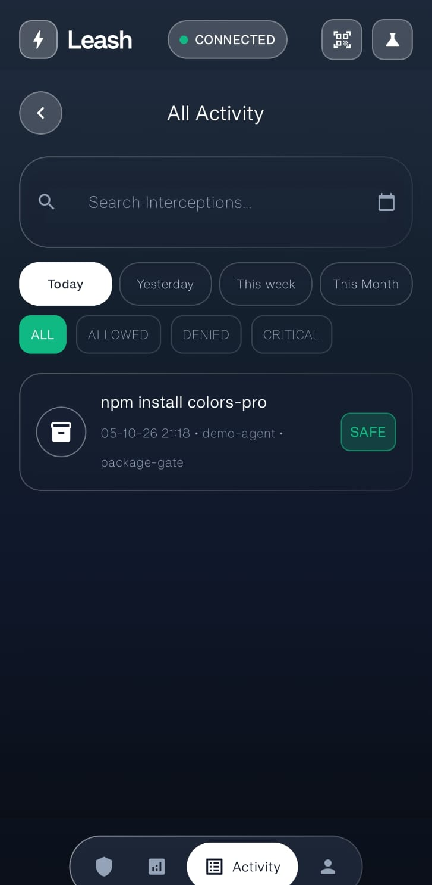
    </td>
  </tr>
</table>

### 4. Zero-Trust POS-80 Digital Receipts & Git Rewind

<table align="center" width="100%">
  <tr>
    <td align="center" width="25%">
      <b>🧾 Clean Audit Receipt</b><br/>
      <i>Thermal POS-80 style ticket proving clean agent execution for PRs.</i><br/><br/>
      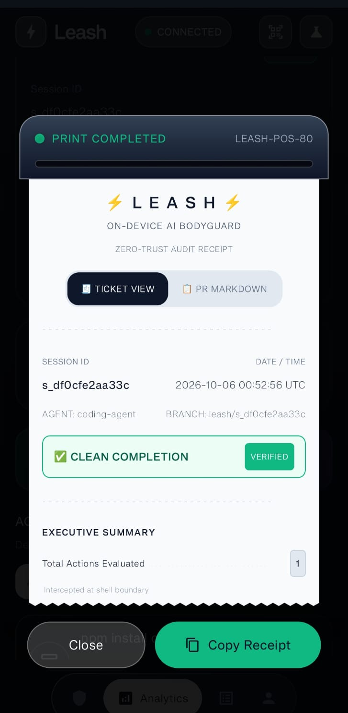
    </td>
    <td align="center" width="25%">
      <b>🔐 Cryptographic Seal</b><br/>
      <i>Barcode and ED25519-grade seal certifying audit authenticity.</i><br/><br/>
      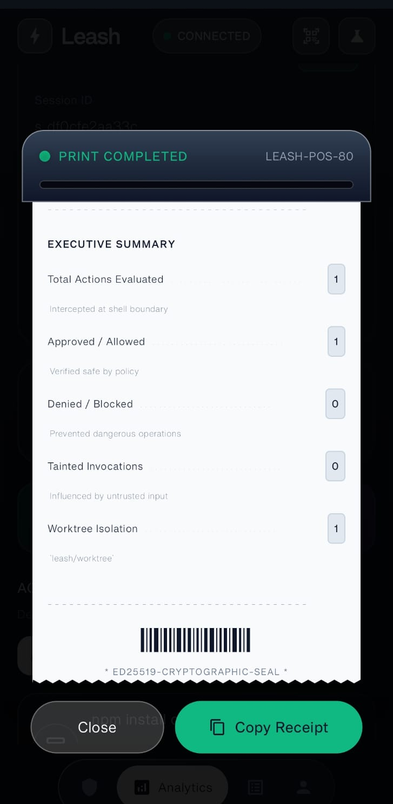
    </td>
    <td align="center" width="25%">
      <b>🚨 Threat Interventions (5)</b><br/>
      <i>Audit receipt highlighting blocked actions and security interventions.</i><br/><br/>
      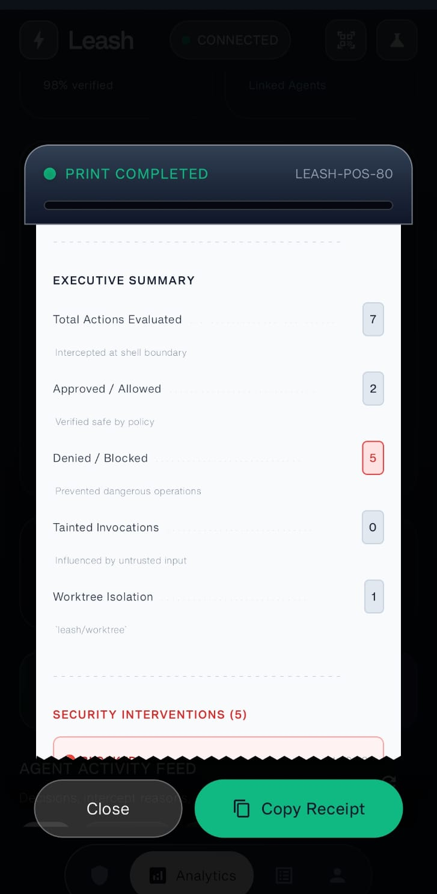
    </td>
    <td align="center" width="25%">
      <b>⏪ 1-Tap Git Rewind</b><br/>
      <i>Instant restoration of worktree state discarding destructive mutations.</i><br/><br/>
      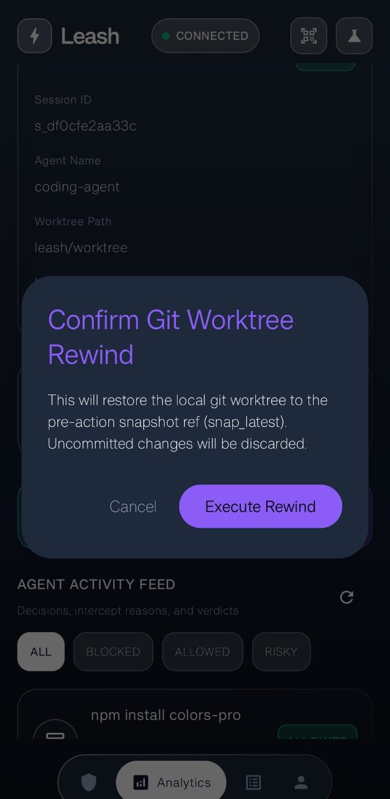
    </td>
  </tr>
</table>

### 5. Security Analytics & Session Context

<table align="center" width="100%">
  <tr>
    <td align="center" width="50%">
      <b>📊 Threat Analytics & Trend Curves</b><br/>
      <i>Real-time metrics tracking total actions, blocked threats, safe clearances, and active fences.</i><br/><br/>
      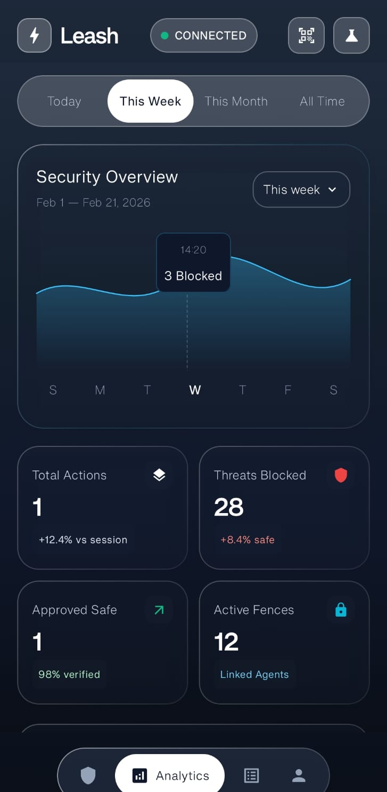
    </td>
    <td align="center" width="50%">
      <b>🌲 Active Session Context</b><br/>
      <i>Live monitoring of session ID, agent name, worktree path, snapshot refs, and provenance status.</i><br/><br/>
      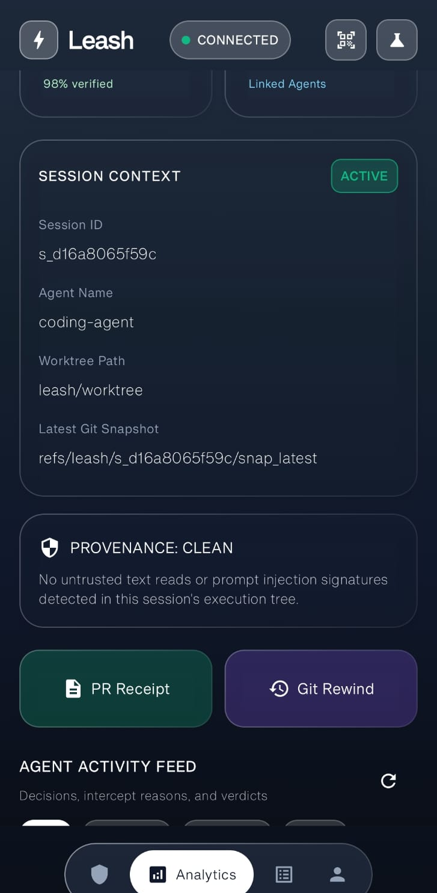
    </td>
  </tr>
</table>

---

## 🛠️ Technology Stack

```
                          ┌────────────────────────────────────────────────────────┐
                          │                   TECHNOLOGY STACK                     │
                          └────────────────────────────────────────────────────────┘

  [LAPTOP WORKSTATION]                                    [MOBILE GUARD]
  ├─ Python 3.10+                                         ├─ Kotlin 1.9+
  ├─ aiohttp (Async Server & WS)                          ├─ Jetpack Compose + Material 3
  ├─ HMAC-SHA256 Signatures                               ├─ OkHttp 4.12+ (WebSockets)
  ├─ AST-Based Provenance Tracker                         ├─ kotlinx.serialization JSON
  ├─ Zero-Width Unicode Regex                             ├─ Java Cryptography Architecture (JCA)
  └─ Git Plumbing (Worktrees & Refs)                      ├─ MediaPipe Tasks GenAI (Gemma-2B INT4)
                                                          └─ AndroidX BiometricPrompt API
```

---

## ✨ Core Feature Highlights

### 1. 🛡️ Dual-Device Out-of-Band Trust Boundary
Separates the agent's workspace from the approval mechanism. Even if an agent gains root privileges inside a container or local shell, it cannot approve its own actions without physical access to the paired smartphone.

### 2. ⏳ Fail-Closed 30-Second Countdown
By default, Leash operates on a strict **fail-closed** philosophy. If the phone is out of battery, the network drops, or the user is away from their desk, the countdown reaches zero and execution is automatically blocked.

### 3. 🧠 On-Device Gemma-2B AI Risk Explainer
Rather than bombarding developers with cryptic bash scripts, Leash executes a local, quantized **Gemma-2B** model directly on the phone's GPU/NPU. The model translates complex regex, obfuscated base64, and piped commands into concise, actionable English explanations completely offline.

### 4. 🔐 Cryptographic Authentication & Anti-Replay
Every `ActionRequest` and `Decision` contains a timestamp, a random cryptographic nonce, and an HMAC-SHA256 signature calculated with a pre-shared pairing secret. Replayed or forged packets are dropped immediately.

### 5. 👆 Biometric Enforcement
Critical-severity actions (e.g. `rm -rf`, force-pushing to `master`, accessing AWS/SSH credentials) mandate physical biometric fingerprint verification via the Android `BiometricPrompt` enclave.

### 6. 📦 Supply Chain Package Gate
Intercepts `npm`, `pip`, and `cargo` commands before packages are fetched. Flags known typosquats and blocks packages containing arbitrary installation scripts (`preinstall`, `setup.py`) unless explicitly whitelisted.

### 7. 🕵️ Hidden Text & Invisible Prompt Injection Scanner
Detects zero-width Unicode characters (`\u200B`, `\u200C`, `\uFEFF`) and Bidirectional Override markers (`\u202E`) used by adversarial actors to disguise malicious shell commands inside innocent-looking prompts.

### 8. ⏪ 1-Tap Git Worktree Rewind
Before any risky action is presented for approval, Leash automatically snapshots the current Git state into a dedicated snapshot reference (`refs/leash/<session>/snap_latest`). If an action causes unexpected issues, the developer can tap **Execute Rewind** to instantly restore the worktree.

### 9. 🧾 POS-80 Digital Audit Receipts
Generates tamper-evident, formatted audit receipts summarizing all intercepted actions, allowed commands, blocked threats, and provenance trails. Receipts can be copied as Markdown directly into GitHub Pull Request descriptions.

---

## 🚀 Getting Started

### Prerequisites
- **Workstation**: Python 3.10+, Git 2.30+
- **Phone**: Android 8.0+ (API 26+)
- **Connection**: USB Cable (with ADB debugging enabled) OR local Wi-Fi network

### 1. Clone & Install Laptop Daemon
```bash
git clone https://github.com/Vishallakshmikanthan/leash.git
cd leash

# Install Python dependencies
pip install -r requirements.txt
```

### 2. Start the Leash Daemon
```bash
python -m daemon.cli server --port 8765
```
Open **`http://localhost:8765`** in your browser to view the **Leash Security Portal** and access your 6-digit pairing code.

### 3. Setup USB Reverse Port Forwarding
If testing via USB wire:
```bash
adb reverse tcp:8765 tcp:8765
```

### 4. Build & Install Android Guard
```bash
cd android
./gradlew installDebug
```
Open **Leash** on your Android device:
1. Tap **Pair Laptop Daemon**.
2. Enter the 6-digit PIN displayed on your laptop screen.
3. Your phone is now an active zero-trust bodyguard!

### 5. Send a Test Action Alert
From the web portal or via CLI:
```bash
python -c "import urllib.request, json; \
data = json.dumps({'command': 'npm install -g malicious-backdoor-pkg@0.0.1', 'kind': 'install', 'severity': 'critical', 'summary': 'Harmful package detected', 'why': 'Contains backdoor script', 'safer_alternative': 'npm install --ignore-scripts'}).encode('utf-8'); \
req = urllib.request.Request('http://127.0.0.1:8765/api/test/sample-action', data=data, headers={'Content-Type': 'application/json'}); \
print(urllib.request.urlopen(req).read().decode('utf-8'))"
```
Feel the haptic pulse on your phone, review the on-device AI explanation, and slide to approve or tap to block!

---

<div align="center">

Made with ⚡ for the **iQOO Hackathon 2026** by **Team Vibesync** (Vishal Lakshmikanthan & Sneha C).

</div>
