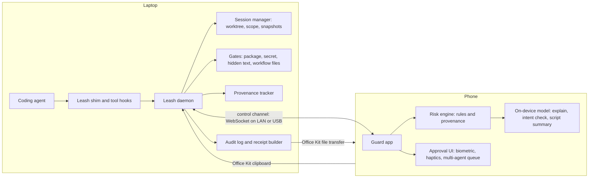
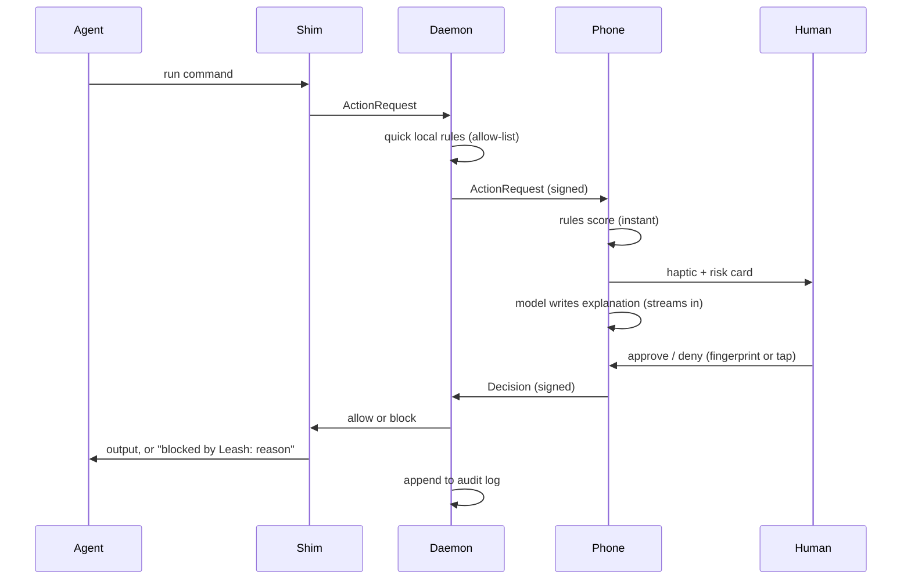

# Leash: Project Plan

**A phone-based safety layer for AI coding agents**

| | |
|---|---|
| **Team** | VibeSync (Vishal and Sneha) |
| **Event** | iQOO Hackathon 2026 (iQOO x Reskilll) |
| **Track** | Developer Tools |
| **Target** | Grand Finale, Bengaluru, Oct 9-11, 2026 (48 hours) |
| **Plan version** | v2, Oct 4, 2026 (v1 plus the expanded feature set, see Appendix A) |

---

## 0. Read this first: assumptions to verify on Day 0

This plan rests on a few facts I could not confirm. Verify each one **today**, because several change the design.

| # | Item | Why it matters | How to verify | Fallback if it fails |
|---|------|----------------|---------------|----------------------|
| 1 | **Entry route, deadlines, team size** | You need a confirmed way into the Finale. Team size is up to 3 per the organizers' pages. | Check iqoo.reskilll.com and ask the organizers. | Nothing to fall back on, so settle this first. |
| 2 | **Is pre-written code allowed?** | Many hackathons require code written during the event. | Read the rules page, or ask in writing. | If not allowed, do only non-code prep (see section 13.1). |
| 3 | **What Office Kit actually exposes** | It is 10% of the score, and the design assumes clipboard sync, file transfer and screen mirroring. | Pair a phone and laptop and test each feature both directions. | Use LAN WebSocket for the control channel and Office Kit for reports and clipboard only. |
| 4 | **Loaner device arrives at check-in** | You cannot benchmark on it beforehand. | Rules or organizers. | Develop on your own Android phone, then re-verify in the first 2 hours at the event. |
| 5 | **Which coding agent you will demo** | Decides how commands are intercepted (hooks vs shell shim). | Install your agent and check for hook or permission support. | Use the shell shim, which does not depend on any agent. |
| 6 | **On-device model runtime** | Decides latency and effort. | Benchmark 2-3 options on your own phone (section 7.5). | Rules-only explanations (always built anyway). |
| 7 | **Red Light / Green Light windows at the Finale** | Decides what you can do on the laptop and when. | Event briefing. | Plan phone-side work for Red Light by default. |
| 8 | **Tool-level hooks in your agent** | Provenance (F1), Secret Fence reads (N2) and the hidden-text scan (N7) must see file reads, file edits and tool calls. A shell shim only sees shell commands. | Install your agent and test whether it offers pre-tool hooks for file reads, edits and tool calls. | Run those scenes on the reference agent (and say so). Rely on filesystem fences: no secrets inside the session worktree, canary files placed outside it. |
| 9 | **Statistics in section 2** | They came from a pasted research note and are unverified. | Open each source and confirm the number, the date and the wording. | Drop any claim you cannot confirm. |

---

## 1. One-liner and pitch

**One-liner:** Leash puts a private, on-device AI bodyguard in your pocket that stops your coding agent from doing something dangerous and tells you why in plain English.

**30-second pitch:**
> AI coding agents now have shell access to our laptops. They can delete files, leak secrets and run scripts they just downloaded, and the only protection is a permission prompt we all click through. Leash moves that decision to your phone. When an agent tries something risky, your phone vibrates, explains the danger in one sentence using a model running on the device, and you approve or deny with your fingerprint. Your code and secrets never leave your hands.

---

## 2. Problem

- **Agents hold real power.** A coding agent that can run commands can modify files, push code, install packages and read environment files.
- **Approval fatigue.** Permission prompts appear constantly, so people approve without reading, or switch to "auto-approve" modes to get work done.
- **Same-screen weakness.** The prompt appears on the same screen as the agent. There is no separate, deliberate checkpoint (like a bank's second-factor confirmation).
- **Hidden instructions.** Text the agent reads (a README, a web page, an issue comment) can contain instructions meant for the agent, not for you.
- **Secrets drift into commits.** Keys and tokens end up in diffs the agent creates.
- **Privacy.** Sending commands and code to a cloud service just to check their safety is itself a leak.

### Evidence to verify before you use it

The claims below came from a research note you pasted in. I could not independently verify them, and the note itself says one source text was cut off. **Open each source, confirm the number, the date and the wording, and cite it properly on your slides. Drop any claim you cannot confirm.**

| Claim (paraphrased from the note) | Source the note names | Status |
|---|---|---|
| In the 2025 Stack Overflow survey, 46% of developers distrust AI accuracy and 33% trust it. | adtmag (reporting the survey) | Verify against the survey itself |
| In July 2026, a compromised npm package shipped an infostealer aimed at credentials of AI developer tools. | Cloud Security Alliance, Passbolt | Verify |
| The Glassworm campaign placed more than 150 malicious packages with invisible code on GitHub, npm and Open VSX. | Cloud Security Alliance, Passbolt | Verify |
| The "Clinejection" attack began with a malicious GitHub issue title. | Passbolt | Verify |
| One malicious install script found an installed AI agent and started it with permission-bypass flags. | Docker | Verify |
| GitGuardian reports about 28.65 million new hardcoded secrets on public GitHub in 2025, up 34%. | Docker page citing GitGuardian | Verify in GitGuardian's own report |
| A study cited by the Cloud Security Alliance found 19.7% of 2.23 million AI code samples contained a fabricated item (such as an invented package). | Cloud Security Alliance | Verify (the note says the text was cut) |
| AI-authored code was 26.9% of production commits by February 2026. | Cloud Security Alliance | Verify |
| At least ten public incidents across six AI coding tools came from agents with weak boundaries. | Docker | Verify |

These map to Leash features: untrusted text (F1, N7), poisoned or invented packages (N1), leaked secrets (N2), and agents with too much freedom (A1, N3, N6).

---

## 3. Solution overview

Leash has three parts:

1. **Laptop side: the Interceptor.** A small daemon plus a command shim sit between the agent and the shell. Every command passes through it before running.
2. **Phone side: the Guard app.** An Android app receives each pending action, scores its risk with rules and a small on-device model, shows a plain-language explanation, and collects the human decision (tap or fingerprint).
3. **Bridge.** A link between the two. The control channel is a LAN WebSocket (the same link can run over USB with `adb reverse`). Office Kit carries clipboard content, files and reports.

Low-risk actions pass silently and are logged. Medium and high-risk actions pause until the phone decides.

### A day with Leash

1. **Start.** `leash run` creates a session worktree and asks for the task scope (allowed paths, commands and hosts).
2. **During work.** Low-risk actions pass in silence. The phone buzzes for risky actions and for "done" and "stuck" events.
3. **Before commit.** Secret, hidden-text and workflow-file checks run.
4. **End of day.** The agent receipt goes into the pull request. Rewind stays available if something breaks.

---

## 4. Goals and non-goals

**Goals**
- A reliable end-to-end loop: agent action, phone alert, human decision, action allowed or blocked.
- Clear, short explanations of why an action is risky.
- Everything private: risk analysis happens on the phone, with no cloud calls.
- Real use of phone features (haptics, biometrics, notifications) and of Office Kit.
- A live demo that never crashes.

**Non-goals (say these out loud to judges)**
- Leash is **not a sandbox.** It is a policy checkpoint at the shell boundary. A hardened version would pair it with OS-level isolation (containers, restricted users).
- Not a replacement for code review or security scanning.
- Not a general-purpose remote control for agents. Existing tools already let you monitor and steer agents from a phone; Leash is about *governing* what they do.
- Not a cloud product. No accounts, no server.
- **Rewind covers repo files only.** It does not undo network calls, global installs or changes outside the worktree.
- **Egress control (if built) covers only tools that respect proxy settings.**
- **Package Gate in online mode reads registry data from the laptop.** Risk analysis still stays on the phone. Offline mode uses only the lockfile and a bundled list of popular package names. Say this clearly in the pitch.
- **No voice approval.** Anyone near the phone could say "approve".

---

## 5. How Leash maps to the judging criteria

| Criterion | Weight | Leash's answer |
|-----------|--------|----------------|
| End Product Quality | 30% | One tight loop, rule-first so it always works, model as enhancement, hard feature freeze, rehearsed demo. |
| Novelty & Impact | 20% | Provenance-aware risk (untrusted text raises the risk of the next action), out-of-band explainable approval and one-tap Rewind. Frames the phone as the *governor* of agents. (Verify competitors before claiming "first".) |
| Creative Phone Use | 15% | Biometric prompt, distinct haptic patterns per risk level, notification actions on a locked screen, done and stuck alerts, one-tap Rewind, on-device NPU inference. |
| Technical Depth | 15% | Interception layer, structured risk engine, on-device LLM with schema-constrained output and a safe fallback, signed message protocol, provenance tracking, package and secret gates, git snapshots, audit log. |
| Office Kit Usage | 10% | Agent receipts (paste-ready for pull requests) and diffs moved by file transfer, "send this diff to my phone" by shared clipboard, mirrored screen during Red Light. All of it real product use. |
| Demo & Presentation | 10% | Live: a real agent tries a dangerous action, the phone buzzes, you block it. Judges can try it. |

---

## 6. Architecture



**Core request flow**



**Provenance flow (F1).** When a tool hook reports that the agent read untrusted text (a README, an issue, a web page), the daemon marks the session as tainted and records the source file and line. Every later risky `ActionRequest` carries that taint, so the phone raises its risk level by one and shows the source line on the card.

---

## 7. Components

### 7.1 Laptop: shim and daemon

- **Daemon** (suggested: Python with `asyncio` and `websockets`, for speed of development). Responsibilities: accept `ActionRequest`s from the shim, forward to the phone, wait for a `Decision`, enforce timeouts, write the audit log, build the report.
- **Shim** (two layers, build in this order):
  1. **Shell wrapper.** Launch the agent through `leash run -- <agent>` with its shell replaced by a Leash shell that submits each command to the daemon before executing. Test with your actual agent first, because some agents call `/bin/bash` directly rather than `$SHELL`.
  2. **Agent and tool hooks.** If your agent supports pre-execution hooks or permission callbacks, wire them to the same daemon. Tool-level hooks also report file reads, file edits and tool calls, which the shell wrapper cannot see. F1, N2 and N7 depend on this (section 0, #8).
- **Git guard.** A wrapper around `git` that routes `push`, `reset --hard`, `clean` and force options through the daemon.
- **Reference agent (fallback).** A small scripted agent that issues a planned sequence of commands through the shim. Keep it for tests and as a demo fallback, but **prefer a real agent in the live demo and say clearly which one you are showing.**

### 7.2 Transport

- **Primary:** WebSocket over the local network, or over USB using `adb reverse`, which also removes dependence on Wi-Fi quality at the venue.
- **Secondary (Office Kit):** a clipboard channel. The phone can write a short signed token (for example `LEASH-DECISION:<id>:<verdict>:<signature>`) to the shared clipboard, and the daemon watches the clipboard for it. This is useful as a fallback and keeps Office Kit genuinely in the loop. **Verify bidirectional clipboard sync on Day 0 before relying on it.**
- **Security:** pair once with a shared secret (QR code shown by the daemon, scanned by the phone). Every message carries a timestamp, a nonce and an HMAC signature. Reject stale or replayed messages.
- **Fail closed:** if the phone is unreachable, high-risk actions are denied and medium-risk actions are queued or denied (configurable). Never default to allow for dangerous actions.

### 7.3 Phone: Guard app

- **Stack:** native Android (Kotlin, Jetpack Compose) is recommended for reliable biometrics, haptics, foreground services and access to on-device model runtimes. Use Flutter only if that is clearly your faster stack, since you will need native bridges for most of the interesting parts.
- **Screens:** Pairing, Live feed of actions (color-coded), Approval card (command, risk, one-line why, source line when the session is tainted, agent and worktree label, Approve/Deny, "view details"), Session screen (task scope, Rewind button, done and stuck alerts), Audit history, Settings (policy and trust rules).
- **Foreground service** keeps the connection alive, and **notification actions** let you approve or deny from the lock screen (high-risk actions still require a fingerprint).
- **Haptics:** distinct vibration waveforms for medium vs high risk. Use `VibrationEffect` waveforms.
- **Biometrics:** `BiometricPrompt` required for high-risk approvals.
- **No voice approval.** Anyone near the phone could say "approve". Approvals use tap and fingerprint only.

### 7.4 Risk engine (rules first)

Rules run instantly and are the source of truth for the verdict. The model only writes the explanation. Parse commands with a proper shell tokenizer (for example Python `shlex`) rather than raw string matching.

Detection categories are listed in section 9. Each rule returns `{category, severity, reason_code}`.

### 7.5 On-device model

- **Job:** turn `{command, category, context}` into one plain sentence and a short "why this matters". Nothing else.
- **Candidates to benchmark** (your own phone first, loaner second): a small instruction-tuned model such as Gemma 2B or Llama 3.2 1B/3B, quantized, through MediaPipe, ExecuTorch, ONNX Runtime or llama.cpp. The organizers mention MediaPipe, ONNX Runtime, ExecuTorch and Qualcomm AI Hub as accepted routes.
- **Benchmark criteria:** time to first token under about 1.5 seconds, full explanation under about 4 seconds, stable memory, no thermal throttling after 20 consecutive runs.
- **Output contract:** strict JSON `{"summary": "...", "why": "...", "safer_alternative": "..."}`. Validate against the schema. If invalid or slow, **fall back to a template** written per rule category. The user must never see a blank card.
- **UX rule:** show the rules verdict immediately and let the explanation stream in afterwards.

### 7.6 Secret Fence (N2)

- Blocks agent reads of `.env`, `~/.ssh` and cloud credential files. Seeing reads needs tool-level hooks (section 0, #8). Without hooks, keep secrets out of the worktree and rely on commit scanning.
- Hides secret values in command output before it reaches the agent or the phone card.
- Scans commits and pushes (diffs and files) for key patterns plus a high-entropy check. Use a small, well-tested pattern set to keep false alarms low.
- **Canary files:** plant fake credentials. Alert when a canary is read, or when a canary value shows up in a command, a diff or an outbound request. Use obviously fake values only.

### 7.7 Provenance-aware risk (F1) and hidden-text scanner (N7)

- Hooks report when the agent reads untrusted text (README, issue, web page, fetched file). The daemon marks the session tainted and records the source file and line.
- The next risky action carries the taint. The phone raises its risk by one level and shows the source line ("this action followed the agent reading README.md, line 12").
- Keep the list of untrusted sources short and explicit. Test that clean sessions do not escalate.
- **N7:** scan files the agent reads or commits for invisible Unicode, bidirectional control characters and hidden comments, and show where they are. It is small to build and gives F1 hard evidence.

### 7.8 Agent receipt (N5) and audit log

- The daemon appends JSON lines: time, command, risk, decision, who decided, latency.
- At session end the receipt builder writes a Markdown report: commands run, approvals and denials, changed files, added dependencies and blocked actions. The developer pastes it into the pull request. Office Kit moves the file between devices.

### 7.9 Session manager (F4, N3, N6, N11)

- **Worktree per session (F4):** each agent session runs in its own git worktree, which limits the damage.
- **Task scope contract (N3):** at session start the user sets allowed paths, commands and hosts. Leash flags drift. A watchlist covers CI workflow files, Dockerfiles, package scripts and lockfiles.
- **Runaway guard (N6):** stops the agent on a repeated failing command, an edit loop or a time limit, and the phone asks what to do.
- **Done and stuck alerts (N11):** the phone buzzes when the agent finishes, waits for input or stays idle.

### 7.10 Package Gate (N1)

Checks before every install: lockfile changes, install scripts, a name close to a popular package, a very new version, and a name that does not exist. Show the reasons on the card.

- **Online mode:** the laptop reads registry data.
- **Offline mode:** uses only the lockfile and a bundled list of popular package names. Use offline mode in the demo and say so.
- Tune thresholds so that legitimate new packages are not blocked without a way through ("allow once" with fingerprint).

### 7.11 Preview before approval (F3) and intent check (F2)

- **F3:** download a script but do not run it. The phone model summarizes what it does. If the model is slow or fails, show the first lines and the rules that fired.
- **F2:** the phone model compares each action with the task text and flags drift. Small models are weak at this, so treat it as a hint. Rules and the task scope (N3) make the real decision.

### 7.12 Rewind (N4)

Before each risky approved action, save a snapshot using hidden git refs (for example under `refs/leash/<session>/<n>`). One tap on the phone rolls back to it. This covers repo files only.

### 7.13 Multi-agent queue (F5)

One phone queue for all agents. Each card shows the agent and its worktree, and similar prompts are grouped together.

### 7.14 Later features (COULD)

N8 (agent-spawn guard and config audit), N9 (egress allow-list through a local proxy), N10 (`leash.yml` policy file and learning mode) and F9 (risk-ranked diff). Show these on a roadmap slide rather than building them.

---

## 8. Data contracts

**ActionRequest** (laptop to phone)
```json
{
  "id": "a_01H...",
  "ts": 1790000000,
  "nonce": "b3f1...",
  "kind": "shell",
  "command": "curl http://localhost:8080/install.sh | sh",
  "cwd": "/home/dev/demo-repo",
  "agent": "demo-agent",
  "sig": "hmac..."
}
```

**Decision** (phone to laptop)
```json
{
  "id": "a_01H...",
  "ts": 1790000003,
  "nonce": "c91d...",
  "verdict": "deny",
  "by": "biometric",
  "note": "Downloads and runs an unknown script",
  "sig": "hmac..."
}
```

**RiskAssessment** (on phone, shown to user)
```json
{
  "id": "a_01H...",
  "severity": "high",
  "category": "remote-script-execution",
  "rule_ids": ["R-NET-PIPE-SH"],
  "summary": "This downloads a script from the internet and runs it immediately.",
  "why": "You cannot see what the script does before it runs.",
  "safer_alternative": "Download it first, read it, then run it."
}
```

**Added in v2**

`ActionRequest` gains these fields, and `kind` can be `shell`, `file_read`, `file_edit`, `tool_call`, `install` or `git`:
```json
{
  "session": "s_01H...",
  "worktree": "leash/s_01H...",
  "agent": "agent-a",
  "kind": "install",
  "taint": { "tainted": true, "source": "README.md", "line": 12 },
  "scope_flags": ["outside-allowed-paths"]
}
```

**ProvenanceEvent** (laptop to phone, when the agent reads untrusted text)
```json
{
  "id": "p_01H...",
  "session": "s_01H...",
  "kind": "untrusted_read",
  "source": "README.md",
  "line": 12,
  "flags": ["hidden-text"],
  "sig": "hmac..."
}
```

**Snapshot reference:** `refs/leash/<session>/<n>`, created before each risky approved action and used by Rewind.

---

## 9. Risk catalog

| Category | What it catches (examples) | Severity | Default action |
|----------|---------------------------|----------|----------------|
| Remote script execution | Piping downloaded content into a shell | High | Preview first (F3), then ask (fingerprint) |
| Destructive file operations | Recursive deletes, wipes outside the project directory | High | Snapshot (N4), then ask (fingerprint) |
| History rewrite / force push | Force push, hard reset, clean on shared branches | High | Snapshot (N4), then ask (fingerprint) |
| Secret exposure | Reading env files, ssh keys or cloud credential files; committing keys or tokens | High | Block and ask |
| Canary touched | A fake credential file is read, or a fake key appears in a command or diff | High | Alert immediately |
| Untrusted-text influence | A risky action after the agent read untrusted text (README, issue, web page) | One level above normal | Ask, show the source line |
| Package install | Lockfile changes, install scripts, names close to popular packages, very new versions, names that do not exist | Medium to High | Ask, show the reasons (N1) |
| Hidden text | Invisible Unicode, bidirectional control characters, hidden comments in files read or committed | Medium | Warn and show where (N7) |
| Sensitive-file edits | CI workflows, Dockerfiles, package scripts, lockfiles | High | Ask (fingerprint) |
| Scope drift | An action outside the task's allowed paths, commands or hosts | Medium | Ask (tap) |
| Runaway behavior | Repeated failing command, edit loop, time limit reached | Medium | Stop the agent, ask the phone (N6) |
| Agent spawning | Starting an AI agent with permission-bypass flags (COULD, N8) | High | Ask or block |
| Permission changes | Broad permission or ownership changes | Medium | Ask (tap) |
| Outbound network | Sending local files to external hosts | Medium to High | Ask |
| Normal development | Tests, linters, builds, reading project files | Low | Allow and log |

Every row you add risks more false alarms, and alarm fatigue is the exact problem Leash exists to fix. Turn rows on in the order given in section 11, test each against the normal-development corpus, and drop any row that interrupts normal work.

---

## 10. Approval policy

- **Low:** auto-allow, log only. No buzz.
- **Medium:** haptic nudge, one-tap approve or deny.
- **High:** strong haptic, biometric required, explanation shown.
- **Timeout:** if no decision within a set time (suggest 30 seconds), the action is denied, and the agent is told why so it can adapt.
- **Trust rules:** "allow this exact command for this session" and "always allow this repo's test command". Never allow "trust everything".
- **Rate limit:** if more than a few prompts arrive in quick succession, group them into one card to prevent a flood.
- **Taint escalation:** if the session is tainted, treat a Medium action as High, and show the source line on the card.
- **Multi-agent grouping:** when several agents are running, group similar prompts into one card that lists each agent and worktree.

---

## 11. Scope tiers

Feature IDs and descriptions are in Appendix A. Effort: S is under 2 hours, M is 2 to 6 hours, L is over 6 hours.

**Hero set (what two people build in 48 hours)**
- A1 to A5 (core)
- F4 (worktree per session)
- F1 and F3 (provenance and preview)
- N1 and N2 (Package Gate and Secret Fence)
- N4 and N5 (Rewind and receipt)
- F8 (the injection demo scene)

Add N7 and N11 if the gate at hour 30 is green. Show everything else on a roadmap slide.

**Tiers**

| Tier | Features |
|------|----------|
| **MUST** | A1, A2, A3, A4, A5, F4, F8 |
| **SHOULD** | A6, F1, F2, F3, F5, F6, F7, N1, N2, N3, N4, N5, N6, N7, N11 |
| **COULD** | F9, N8, N9, N10 |
| **WON'T** | Voice approval (anyone near the phone could say "approve"), cloud services, accounts, multi-user, supporting every laptop OS, a general agent remote control |

**Feasibility warning** (my estimate, not the organizers'). The hero set has five M items (roughly 10 to 30 hours), three S items (up to about 6 hours) and the core on top. Two people in 48 hours, with sleep and Red Light windows, will not finish all of it to demo quality. Treat the tiers as a ceiling, not a promise, and build in this order. **Stop adding when a gate turns red.**

1. Core A1 to A5 and F4 (gate G2 at H8)
2. N2 Secret Fence
3. F1 provenance, then F8 (the injection scene needs both)
4. N5 receipt (small, and your clearest Office Kit moment)
5. N1 Package Gate
6. N4 Rewind
7. F3 preview and A6 model explanations
8. N7, N11, F6 and F7 (all small)

Everything else only if time remains.

If your agent has no tool-level hooks (section 0, #8), F1, parts of N2 and N7 shrink, and the injection scene runs on the reference agent. Say so openly.

---

## 12. Team split (suggested)

Assign by strengths. Split by side, not by feature, so you can both work in parallel.

| Role | Owns |
|------|------|
| **Laptop lead** | Daemon, shim, git guard, policy, gates, session manager, receipt builder, reference agent, demo sandbox |
| **Phone lead** | Android app, UI, haptics, biometrics, model integration, notification actions |
| **Shared** | Protocol and message contracts (agree on these first), Office Kit flows, demo script, pitch, rehearsals |

If you add a third member, give them: test corpus and benchmarking, demo scenarios and sandbox, pitch slides and Q&A preparation.

**Working rule:** agree the JSON contracts in section 8 in the first hour. After that, each side can build against a mock of the other.

**Feature ownership (suggested)**

| Features | Suggested owner |
|----------|-----------------|
| A1, A4, A5, F4, N1, N2, N3, N4, N5, N6, N7 | Laptop lead |
| A3, A6, F2, F5, N11 | Phone lead |
| A2 (protocol) | Shared. Agree the contracts first. |
| F1, F3 | Shared. The laptop tracks and fetches, the phone scores and displays. |
| F6, F7, F8 | Shared |

The laptop side carries more items. If the phone lead finishes early, they take N5, N6 and N7.

---

## 13. Timeline

### 13.1 Pre-event (Oct 3 to Oct 8)

**First, check whether pre-written code is allowed (section 0, item 2).** If it is *not* allowed, do only: Day 0 verification, benchmarks on your own phone, the test corpus, demo scenario scripts, pitch and design. Do not commit app code before the event.

| Day | Plan |
|-----|------|
| **Oct 3-4 (Sat-Sun)** | Day 0 verification (section 0), including tool-level hook support in your chosen agent (#8). Confirm route and rules. Verify the evidence list in section 2. Submit the screening idea (section 18). Set up the repo. |
| **Oct 5** | Laptop: shell wrapper, daemon with a mock phone, worktree per session (F4), rule engine with a tokenizer. Start the command corpus and the evasion list. |
| **Oct 6** | Android skeleton: pairing, WebSocket client, approval card, haptics, notification actions. Laptop: tool hooks, provenance events, Secret Fence with canary files. |
| **Oct 7** | Benchmark 2-3 on-device models on your own phone and pick one. Write the JSON prompts and template fallbacks. Package Gate with a bundled popular-name list. Receipt builder. |
| **Oct 8** | Demo sandbox with the planted README and fake files (F8). Full dry run. Finish the pitch. Pack and travel. |

**Packing checklist:** laptop and charger, your own Android phone as backup, USB-C cables, a small travel router or a hotspot-capable phone (for a stable local network), power bank, notes with the pitch and the demo script.

### 13.2 Finale (48 hours, H0 = kickoff)

Adapt to the real Red Light / Green Light windows. As a default, do phone-side work and testing during Red Light, and heavy laptop coding during Green Light.

| Hours | Focus | Gate |
|-------|-------|------|
| **H0-2** | Check in, receive loaner, pair Office Kit, verify channels, re-run the model benchmark **on the loaner**. | **G1:** link works and the model runs acceptably, or the model is demoted to template-only. |
| **H2-8** | Core loop (A1-A5) and worktree per session (F4). | **G2 (H8):** end-to-end works with rules only. You now have a shippable product. |
| **H8-16** | Full rule set, haptics, biometrics, lock-screen actions, Secret Fence (N2), tool hooks, provenance events and taint escalation (F1). | |
| **H16-24** | Injection scene (F8) working end to end, A6 model explanations with fallback, receipt (N5), Package Gate (N1). | |
| **H24-30** | Rewind (N4), preview (F3), Office Kit flows (receipt transfer, clipboard). | **G3 (H30):** freeze the hero set. Decide whether N7 and N11 go in. |
| **H30-38** | N7 and N11 if G3 is green, plus the evasion table (F6) and fatigue metric (F7). Otherwise harden and polish. | |
| **H38-44** | Bug bash. Run the full demo at least 10 times and fix every flake. | |
| **H44-48** | Freeze code. Charge everything. Final rehearsal. Submit. | **No new features.** |

**Rule:** at every gate, if a feature is behind, cut it. A smaller product that runs every time beats a larger one that crashes once on stage.

---

## 14. Testing and evaluation

- **Command corpus:** about 60 commands, half dangerous and half normal developer work (tests, builds, git status, installs of known packages). Measure detection of the dangerous ones **and false alarms on the normal ones**. Aim for zero false alarms on your demo scenarios.
- **Latency:** time from the agent's command to the phone buzzing (target under about 500 ms), and to the explanation appearing (target under about 4 s).
- **Reliability:** run the full demo loop 20 times in a row and count failures.
- **Failure drills:** kill Wi-Fi, lock the phone, drop the connection mid-request, send a malformed or replayed message. Each must fail closed.
- **Privacy check:** confirm no network calls leave the phone during analysis. For the demo, show it with mobile data off and the laptop and phone on a private network with no internet uplink. (Airplane mode alone also cuts the local link, so use a local network instead.)
- **Thermal check:** model runs for 20 consecutive actions without slowing sharply.
- **Evasion table (F6):** test about 10 ways around Leash, such as obfuscated or encoded commands, aliases, commands hidden inside scripts or package scripts, indirect reads through other tools, shell expansion tricks, and renamed or symlinked sensitive paths. Publish what Leash catches and what it misses.
- **Fatigue metric (F7):** on the same task, count prompts per hour for the agent's own permission prompts versus Leash. Report the real numbers. If Leash is not lower, say so, or leave the claim out.
- **Package Gate corpus:** known-good packages, near-popular names, names that do not exist, and very new versions. Test offline mode using only the lockfile and the bundled list.
- **Rewind test:** after a rollback, the diff against the snapshot must be empty for tracked files. State clearly that repo files only are covered.
- **Provenance test:** the same action must score differently in a tainted session and in a clean one, and clean sessions must not escalate.
- **Network note:** Package Gate in online mode reads registry data from the laptop. In the demo, use offline mode and say so.

---

## 15. Demo plan (3 to 5 minutes, live)

**Safety note:** every "attack" in the demo is a harmless stand-in inside a throwaway sandbox. The planted README is harmless text, the `.env` file holds fake values, and the "suspicious" package comes from a **local test package index**. Never publish a look-alike package to a public registry, and never run anything genuinely harmful.

**Setup:** laptop running a real agent through Leash, sandbox repo with the planted situations, phone paired, internet disabled and Package Gate in offline mode to show the analysis is local.

| Time | Scene |
|------|-------|
| 0:00-0:30 | **Problem.** "Our agents can run anything, and we click through the prompts." Use only statistics you verified (section 2). |
| 0:30-1:30 | **Scene 1: injection (F8, F1, N2).** A planted README makes the real agent try to send a fake `.env`. The phone buzzes, the card shows the source line from the README and the raised risk level, and Secret Fence has blocked the read. You deny with your fingerprint. |
| 1:30-2:15 | **Scene 2: Package Gate (N1).** The agent tries to install a package whose name is one letter off a popular one. The card lists the reasons: close to a popular name, very new, has an install script. |
| 2:15-2:45 | **Scene 3: normal work.** Tests and builds run with no buzz, only logged. Show the fatigue number if you measured it. |
| 2:45-3:30 | **Scene 4: Rewind (N4).** Approve a risky but legitimate action, something breaks, and one tap on the phone restores the repo. |
| 3:30-4:15 | **Office Kit and receipt (N5).** The receipt moves to the laptop by file transfer and is pasted into a pull request. Copy a diff on the laptop and see it on the phone. |
| 4:15-4:45 | **Depth, privacy and limits.** Name the model and runtime, show the evasion table (what Leash catches and misses), and state that Leash is a checkpoint, not a sandbox. |
| 4:45-5:00 | **Close and roadmap slide.** Show what is not built yet. |

**If you only get 3 minutes:** problem (20 s), Scene 1, Scene 2, receipt, close.

**Fallbacks:** if the real agent misbehaves, switch to the reference agent and say so. If your agent has no tool-level hooks, run Scene 1 on the reference agent and say so. If the model is slow, template explanations appear instantly. Keep a recorded backup video **only for total failure**, because organizers favor live demos.

---

## 16. Pitch and Q&A preparation

**Likely questions and honest answers**

- **"Why not just use the agent's own permission prompts?"** They appear on the same screen, get clicked through, and rarely explain the risk. Leash is a separate checkpoint on a separate device with a plain-language reason, like a second factor.
- **"Can the agent bypass the shim?"** Leash is a policy checkpoint at the shell boundary, not a sandbox. A determined attacker needs OS-level isolation. We would pair Leash with containers or restricted users for production. (Say this yourselves before they ask.)
- **"Aren't there tools that already control agents from a phone?"** Existing tools let you monitor and steer agents remotely, and some send notifications. Leash is about gating risky actions with local, explainable analysis. Check current tools again just before the event so your claim is accurate.
- **"Why on-device?"** Commands and code are sensitive, so sending them to a cloud service to check their safety would defeat the purpose. On-device is a requirement here, not a gimmick.
- **"How do you avoid alarm fatigue?"** Low-risk actions pass silently, we keep the rule set small, we group prompts, and we measured false alarms on a test corpus.
- **"What if the model is wrong?"** Rules decide the verdict. The model only explains, and a template covers failures.
- **"Where do your statistics come from?"** Cite only the ones you verified (section 2) and show the source on the slide. Do not quote a number you could not confirm.
- **"Doesn't Package Gate need the internet?"** In online mode the laptop reads registry data. Offline mode uses only the lockfile and a bundled list of popular package names. Risk analysis stays on the phone either way.
- **"Can't an attacker rename a file or encode a command?"** Some tricks work. Our evasion table shows what Leash catches and what it misses, which is why we recommend pairing it with OS-level isolation.
- **"Does Rewind undo everything?"** No. It restores repo files only, not network calls, global installs or changes outside the worktree.
- **"Why no voice approval?"** Anyone near the phone could say "approve". Approvals need a tap or a fingerprint.

---

## 17. Risk register

| Risk | Likelihood | Impact | Mitigation |
|------|-----------|--------|------------|
| Agent bypasses the shim (calls the shell directly) | Medium | High | Test your agent early. Use hooks where available. Fall back to the reference agent. |
| Office Kit doesn't expose what we assumed | Medium | Medium | Day 0 test. LAN WebSocket for control, Office Kit for reports and clipboard. |
| Model too slow or heavy on the loaner | Medium | Medium | Benchmark early. Template fallback is already built. |
| Venue Wi-Fi unreliable | High | High | Use USB with `adb reverse` or a travel router. |
| Alarm fatigue or false positives in demo | Medium | High | Small rule set, corpus tests, demo scenarios rehearsed. |
| Scope creep | High | High | Hard gates, cut COULD items first. |
| Pre-written code not allowed | Unknown | Medium | Check rules on Day 0 and follow section 13.1. |
| Phone or laptop dies mid-demo | Low | High | Backup phone, charged devices, power bank. |
| Biometric unreliable on stage | Medium | Low | Tap fallback for approvals. |
| Another team has a similar idea | Medium | Medium | Lean on execution quality, privacy story and live reliability. |
| Your agent has no tool-level hooks | Medium | High | Check on Day 0 (section 0, #8). Use an agent with hooks, or run those scenes on the reference agent and say so. Use filesystem fences (no secrets in the worktree, canary files outside it). |
| Hero set is too large for two people | High | High | Follow the build order and cut line in section 11, and respect the gates. |
| Unverified statistics reach the pitch | Medium | Medium | Verify each one (section 2) or leave it out. |
| Package Gate blocks legitimate new packages | Medium | Medium | Tune thresholds, show reasons, and offer "allow once" with fingerprint. |
| Rewind misses untracked files or restores the wrong state | Low | High | Test it. Claim repo files only. |
| Provenance escalates too often | Medium | Medium | Keep the untrusted-source list short, show the source line, and test clean sessions. |

---

## 18. Screening submission draft

*(Edit to match the form's limits. Check for word counts.)*

**Title:** Leash: a phone-based safety layer for AI coding agents

**Track:** Developer Tools

**Problem:** AI coding agents can run shell commands, push code and handle secrets on our laptops. Permission prompts appear on the same screen, get clicked through, and rarely explain the risk, so developers either approve blindly or switch to auto-approve. *(Add one verified statistic and its source here; see section 2.)*

**Solution:** Leash moves the decision to the developer's phone. A laptop interceptor sends each risky action to an Android app. An on-device model, running on the phone's NPU, explains the danger in one plain sentence, and the developer approves or denies with a fingerprint or a tap. Low-risk actions pass silently. If the phone is unreachable, dangerous actions are denied.

**What goes beyond a permission prompt:** Leash tracks where an action came from. If the agent has just read untrusted text, such as a README or an issue, the next risky action is rated higher and the card shows the source line. It also checks packages before they are installed, fences off secrets, snapshots the repo before risky actions so one tap on the phone can roll back, and produces a receipt the developer pastes into the pull request.

**Why on-device and phone-first:** commands and code are sensitive, so analysis stays on the device. The phone adds biometrics, haptics and lock-screen actions that a laptop cannot offer. Office Kit carries clipboard content, diffs and agent receipts between the two devices.

**Impact:** safer use of AI coding agents without slowing developers down, and an auditable record of what agents were allowed to do.

---

## 19. Tech stack and repo layout

**Suggested stack**
- Phone: Kotlin, Jetpack Compose, BiometricPrompt, a foreground service, one on-device model runtime chosen after benchmarking
- Laptop: Python (asyncio, websockets), shell wrapper, small CLI (`leash run`, `leash pair`, `leash report`)
- Protocol: JSON over WebSocket with HMAC signatures

**Repo layout**
```
leash/
  daemon/            # laptop daemon, policy, audit, receipt builder
  shim/              # shell wrapper, git guard, agent and tool hooks
  gates/             # package gate, secret fence, hidden-text scanner, workflow watchlist
  session/           # worktree, scope contract, snapshots (rewind), runaway guard
  reference-agent/   # scripted agent for tests and fallback
  android/           # Guard app
  contracts/         # JSON schemas and examples
  corpus/            # test commands, evasion cases, package cases
  demo/              # sandbox repo, planted README, fake .env, local test package index
  docs/              # pitch, architecture notes, this plan
```

---

## 20. Definition of done

- [ ] End-to-end loop works 20 times in a row
- [ ] Zero false alarms on the demo scenarios
- [ ] All three demo scenes run live without edits
- [ ] High-risk approvals require a fingerprint, with a tap fallback
- [ ] Dangerous actions are denied when the phone is unreachable
- [ ] Explanations never appear blank (template fallback verified)
- [ ] Every action is written to the audit log
- [ ] No cloud calls during analysis (verified)
- [ ] Backup phone and laptop ready, devices charged
- [ ] Pitch and Q&A rehearsed at least 3 times
- [ ] Limits stated honestly in the pitch
- [ ] Injection scene (F8) runs live: the tainted action is escalated and shows the source line
- [ ] Secret Fence blocks the fake `.env` read, and the canary alert is verified
- [ ] Package Gate flags the demo look-alike package in offline mode
- [ ] Rewind restores the repo to the snapshot with an empty diff
- [ ] The receipt pastes cleanly into a pull request and reaches the laptop through Office Kit
- [ ] Evasion table and fatigue numbers are measured, not guessed (or removed from the pitch)
- [ ] Every statistic on the slides is verified with a source
- [ ] The roadmap slide clearly shows what is not built

---

## Appendix A: Feature catalog

Effort: S is under 2 hours, M is 2 to 6 hours, L is over 6 hours.

### Group A: Core

| ID | Feature | Tier |
|----|---------|------|
| A1 | Shell shim and tool-level hooks (file edits and tool calls) | MUST |
| A2 | Signed phone link that fails closed | MUST |
| A3 | Approval card, haptics, fingerprint for high risk | MUST |
| A4 | Rule engine with a shell tokenizer | MUST |
| A5 | Audit log | MUST |
| A6 | On-device model with template fallback | SHOULD |

### Group B: Agent-safety features

| ID | Feature | What it does | Effort | Tier |
|----|---------|--------------|--------|------|
| F1 | Provenance-aware risk | Tracks untrusted text the agent read (README, issue, web page). The next risky action gets a higher risk level. The card shows the source line. | M | SHOULD (main feature) |
| F2 | Intent check | The phone model compares each action with the task text and flags drift. | M | SHOULD |
| F3 | Preview before approval | Downloads a script but does not run it. The model summarizes what it does. | M | SHOULD |
| F4 | Worktree per session | Each agent session runs in its own git worktree, which limits the damage. | S | MUST |
| F5 | Multi-agent queue | One phone queue for all agents. Each card shows the agent and worktree. Similar prompts group together. | M | SHOULD |
| F6 | Evasion test table | Test 10 bypass tricks. Publish what Leash catches and what it misses. | S | SHOULD |
| F7 | Fatigue metric | Count prompts per hour: the agent's own prompts against Leash on the same task. | S | SHOULD |
| F8 | Injection demo scene | A harmless planted README makes a real agent try to send a fake `.env` file. | S | MUST (demo) |
| F9 | Risk-ranked diff | Shows the risky changes first in the review. | M | COULD |

Voice approval stays cut: any person near the phone can say "approve".

### Group C: Features for daily work

| ID | Feature | What it does | Effort | Tier |
|----|---------|--------------|--------|------|
| N1 | Package Gate | Checks before each install: lockfile changes, install scripts, a name close to a popular package, a very new version, a name that does not exist. | M | SHOULD (hero) |
| N2 | Secret Fence | Blocks agent reads of `.env`, `~/.ssh` and cloud credential files. Hides secret values in output. Scans commits. Adds canary files with fake credentials and alerts when a canary is read or used. | M | SHOULD (hero) |
| N3 | Task scope contract | At session start the user sets allowed paths, commands and hosts. Leash flags drift. A watchlist covers CI workflow files, Dockerfiles, package scripts and lockfiles. | M | SHOULD |
| N4 | Rewind | Saves a snapshot (hidden git refs) before each risky approved action. One tap on the phone rolls it back. Covers repo files only. | M | SHOULD (hero) |
| N5 | Agent receipt | At session end, writes a Markdown report: commands, approvals, changed files, added dependencies, blocked actions. The developer pastes it in the pull request. Office Kit moves the file between devices. | S | SHOULD (hero) |
| N6 | Runaway guard | Stops the agent on a repeated failing command, an edit loop or a time limit. The phone asks what to do. | S | SHOULD |
| N7 | Hidden text scanner | Finds invisible Unicode, bidirectional control characters and hidden comments in files the agent reads or commits. | S | SHOULD |
| N8 | Agent-spawn guard | Asks or blocks when a process starts an AI agent with permission-bypass flags. A config audit lists agent settings, hooks and tool servers and flags wide permissions. | S to M | COULD |
| N9 | Egress allow-list | A local proxy allows only listed hosts, such as the package registry and git remote. Covers only tools that respect proxy settings. | M | COULD |
| N10 | Policy file and learning mode | A `leash.yml` file in the repo holds the rules. Learning mode watches one session and proposes allow rules from approved actions, which reduces alarm fatigue. | M | COULD |
| N11 | Done and stuck alerts | The phone buzzes when the agent finishes, waits for input or stays idle. | S | SHOULD |

**Network note:** N1 reads registry data from the laptop in online mode. Offline mode uses only the lockfile and a bundled list of popular package names. Say this clearly in the pitch. The risk analysis still stays on the phone.

### Roadmap slide

Show everything not built in the 48 hours: N8, N9, N10, F9, and any SHOULD item that missed the gate.
